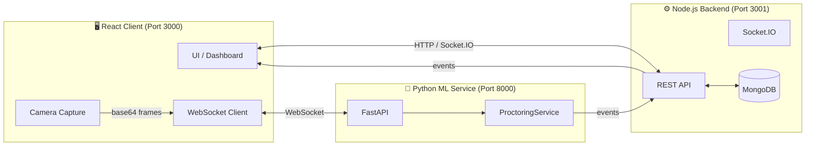
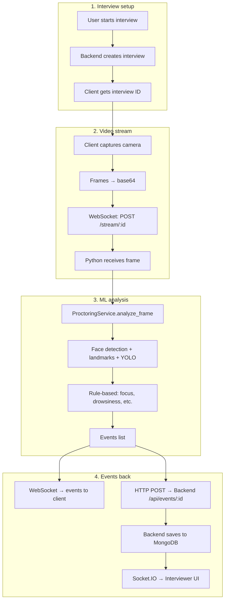
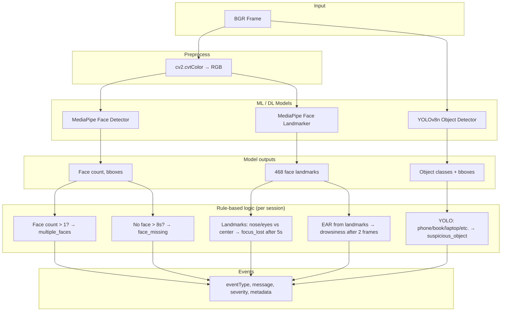
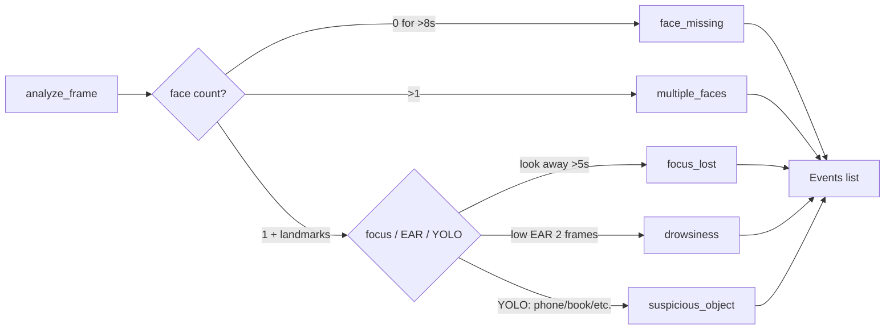

# Flow Diagram – Interview Proctoring System

End-to-end architecture, data flow, and ML pipeline.

---

## 1. System Architecture (High-Level)



---

## 2. End-to-End Data Flow



---

## 3. ML Pipeline (Per Frame)



---

## 4. ML Models Used

| Component | Model / method | Purpose |
|-----------|----------------|--------|
| **Face detection** | MediaPipe Face Detector (BlazeFace short-range) or Tasks API `face_detector.tflite` | Face count, presence |
| **Face landmarks** | MediaPipe Face Mesh / Face Landmarker (468 points) | Focus (nose/eyes vs center), drowsiness (EAR) |
| **Object detection** | YOLOv8n (Ultralytics, COCO) `yolov8n.pt` | Phone, book, laptop, mouse, keyboard, remote |
| **Focus** | Rule-based | Nose/face center vs screen center; timeout 5 s |
| **Drowsiness** | Rule-based | Eye Aspect Ratio (EAR) from landmarks; threshold + 2 frames |
| **Face missing** | Rule-based | No face for 8 s → event |
| **Event dedup** | Rule-based | Same event type cooldown 3 s |

---

## 5. Event Types (Output of ML Pipeline)



---

## 6. File / Component Map

| Layer | Location | Role |
|-------|----------|------|
| **Client** | `client/` (React, Vite) | UI, camera, WebSocket to ML, Socket.IO to backend |
| **Backend** | `server/` (Node, Express) | Interviews, events API, MongoDB, Socket.IO |
| **ML service** | `app/main.py` | FastAPI, WebSocket `/stream/:id`, POST `/analyze_frame` |
| **Proctoring logic** | `app/proctoring_service.py` | YOLO + MediaPipe + rules, session state, events |
| **Face models** | `app/models/face_detector.tflite`, `face_landmarker.task` | MediaPipe Tasks API assets |
| **YOLO** | `app/yolov8n.pt` | Ultralytics COCO object detection |

---

## 7. Quick Reference – Single Frame Flow

```
Camera → base64 → WebSocket → FastAPI
  → decode → BGR frame
  → ProctoringService.analyze_frame(frame, interview_id)
      → RGB → Face Detector → face count
      → RGB → Face Landmarker → 468 landmarks
      → BGR → YOLO → object boxes + classes
      → Session state (last_face_time, focus_lost_start, ear_frames, …)
      → Rules (timeouts, EAR, focus threshold, cooldown)
      → List of events
  → events → WebSocket reply + POST to Backend /api/events/:id
```

You can paste the Mermaid blocks into [Mermaid Live Editor](https://mermaid.live) to edit or export as PNG/SVG.
